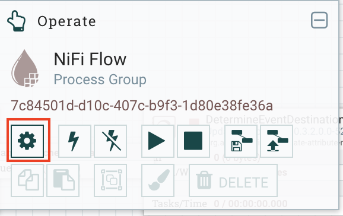

# se-event-lab-1
Author: Alexander Martens

## Deploy the pre-requisites
1.  Log in to virtual machine where Ambari server is running
```
ssh -i .ssh/<private_key_pem_file> cloudbreak@<ambari_host>
```
2.  Change user to root
```
sudo -i
```
3.  Change user to root
```
git clone https://github.com/martensa/se-event-lab-1
```
4.  Execute the deployment script
```
cd se-event-lab-1
./deployPreRequisites.sh
```
5.  Start CometD messaging container
```
./startContainer.sh
```

## Go to NiFi UI
1. Upload NiFi template nifi-credit-fraud.xml (see NiFiFlow folder in this repository).


2. Add the uploaded template to the canvas per drag & drop.


3. Review the entire flow and get a understanding of the single steps.
4. Resolve the two warnings at "QueryRecord" and “QueueIncomingTransaction” processors. Therefore, you need to go to Settings > Controller Services. 



Please edit the HortonworksSchemaRegistry service and update the host name of the Schema Registry URL. Then, you can enable this service and all the referencing components. 


The warnings should get resolved.
5. Update the Kafka broker URLs of both “QueueIncomingTransaction” processors with the appropriate host name.
6. Start the entire flow in NiFi.\n


## Go to Schema Registry UI
1. Make sure that the following schemas exists: original_transaction, incoming_transaction, customer_validation
2. Review the schemas for the different events in order to get a feeling about the data.

## Start Credit Card Transaction Simulator
1.  Log in to virtual machine where Ambari server is running
```
ssh -i .ssh/<private_key_pem_file> cloudbreak@<ambari_host>
```
2.  Change user to root
```
sudo -i
```
3.  Execute the start script
```
cd se-event-lab-1
./startSimulation.sh
```

## Go to Streaming Analytcis Manager UI
1. Use the navigation bar at the right to open the built-in model registry.
2. Click on +,upload the PMML Credit Fraud model pmml-credit-fraud.xml (see PMMLModel folder in this repository) and name it "credit-fraud".


3. Download the CreditCard Fraud streaming application credit-fraud.json (see SAMTopology folder in this repository)

4. Replace all occurences of {{HOST1}} with your Ambari hostname.

3. Navigate to "My Applications", import the existing application and name it "Credit-Fraud".


4. Review the analytics pipeline and get a understanding of the single steps.

5. Make sure that you have the right hostname provided for the following processors: "IncomingTransactions", "GetCustomerDetails", "GetPurchaseAmountStats", "GetLastTransaction", "GetTransactionDistance", "SendStatusLegitimate", "SendStatusFraud", "UpsertLegitTransaction", "UpsertFraudTransaction", "TransactionHistoryOLAPIndex".

6. Start the streaming application


## Explore the legitimate and fraudulemt transaction data
1. Create your own visualization using Zeppelin
2. Finalize the demo:
[TransactionMonitorUI](https://github.com/vakshorton/CreditCardTransactionMonitor)
[TransactionMonitorMobileApp](https://github.com/vakshorton/CreditCardTransactionMonitorMobileApp)

## PMML model generation
1. Import notebook note.json into Zeppelin (see Zeppelin folder in this repository)
2. Review the Zeppelin notebook that was used to learn the PMML model
